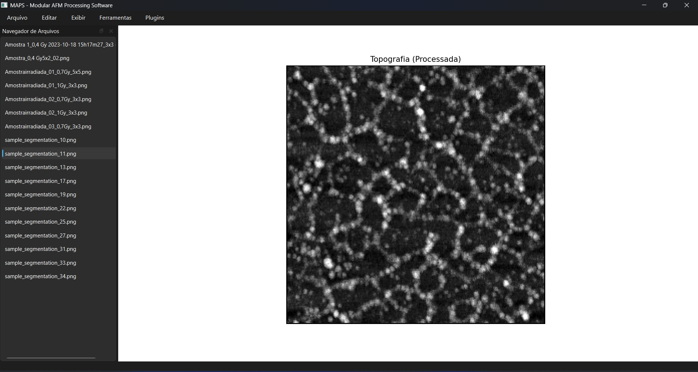
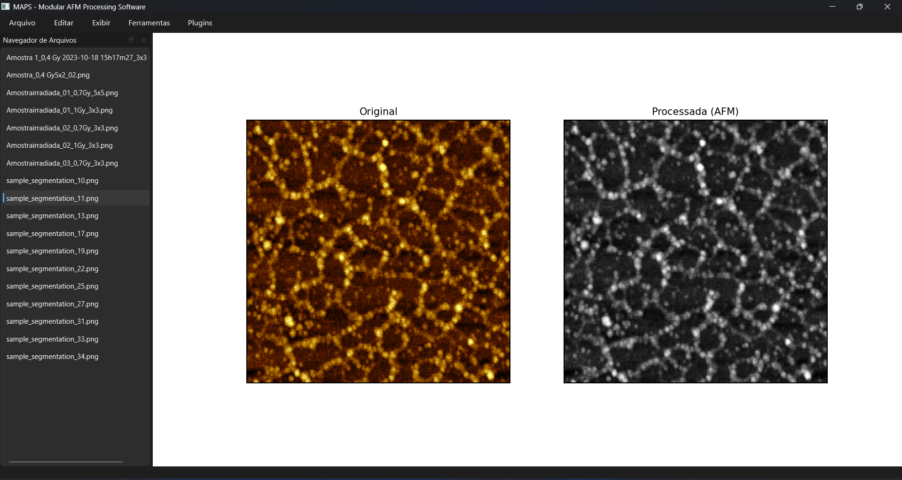
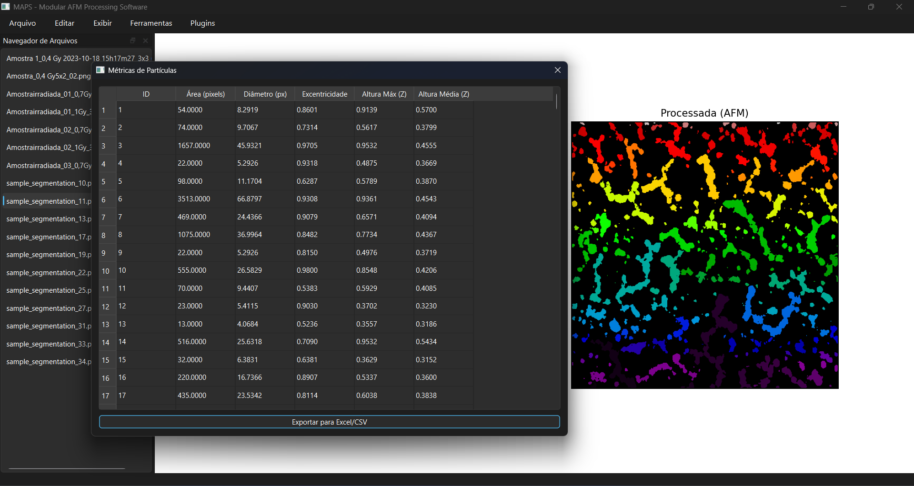
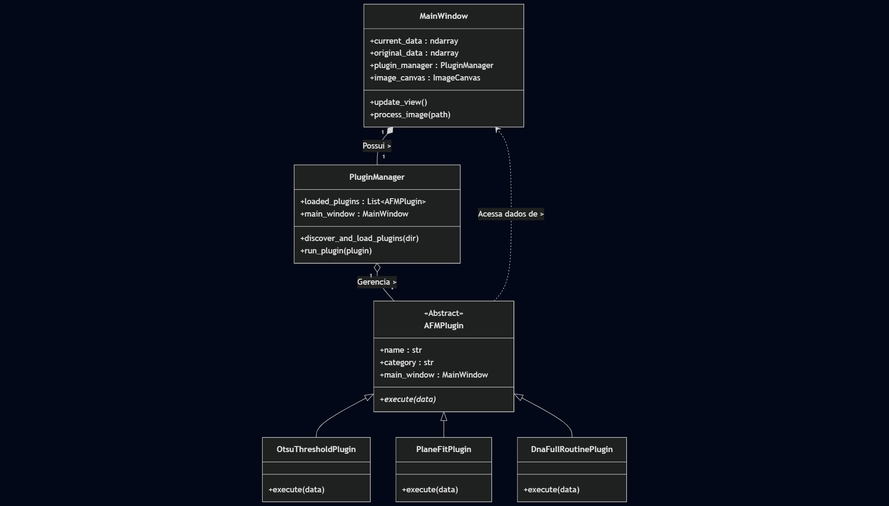

> **MAPS** é uma solução *open-source* que substitui a análise manual de imagens de microscopia por um fluxo de trabalho automatizado e reprodutível. Através de uma arquitetura de plugins, o software processa topografias de AFM, segmenta nanoestruturas e gera relatórios estatísticos precisos sobre amostras biológicas.

# MAPS - Modular AFM Processing Software


> **Nota:** Este software foi desenvolvido como parte do Trabalho de Conclusão de Curso (TCC) em Ciência da Computação.

---

## 📄 Sobre o Projeto

O **MAPS** (*Modular AFM Processing Software*) é uma plataforma de código aberto desenvolvida para o processamento, segmentação e análise quantitativa de imagens de Microscopia de Força Atômica (AFM).

O objetivo principal é automatizar o fluxo de trabalho científico, substituindo análises manuais subjetivas por algoritmos de visão computacional robustos, com foco especial na caracterização de fitas de DNA e nanoestruturas.

### 📸 Interface Principal



---

## ✨ Funcionalidades Principais

O sistema opera sobre uma arquitetura de **Plugins**, permitindo a extensão de funcionalidades sem alterar o núcleo.

### 1. Visualização Científica
* Renderização térmica (`afmhot`) para topografia.
* Renderização espectral (`nipy_spectral`) automática para segmentação.
* **Modo Comparativo:** Visualização lado a lado (Original vs. Processada).



### 2. Pré-processamento
* **Nivelamento de Plano (*Plane Fit*):** Correção de inclinação da amostra (Tilt).
* **Correção de Linhas (*Line Flatten*):** Remoção de artefatos de varredura.
* **Filtros de Ruído:** Gaussiano e Mediana.
* **Realce:** CLAHE (Equalização Adaptativa de Histograma).

### 3. Segmentação e Morfologia
* **Limiarização:** Automática (Otsu) e Manual (Slider).
* **Morfologia Matemática:** Abertura (limpeza de ruído) e Esqueletização (*Skeletonize*).
* **Rotulação (*Labeling*):** Identificação de partículas individuais.


### 4. Análise Quantitativa
* **Metrologia de DNA:** Cálculo automático do comprimento de contorno ($L_c$) de fitas.
* **Estatística:** Média, Desvio Padrão e histogramas.
* **Exportação:** Geração de arquivos `.csv` e `.xlsx`.

### 5. Automação (Batch Mode)
* Processamento em lote de diretórios inteiros.
* Geração de relatório global (`_RESUMO_GLOBAL.csv`) com estatísticas de todas as amostras.

---

## 🚀 Instalação e Execução

### Pré-requisitos
* Python 3.10 ou superior.

### Passo a Passo

1.  **Clone o repositório:**
    ```bash
    git clone https://github.com/ProgGusta/software_maps_tcc.git
    cd software_maps
    ```

2.  **Crie e ative o ambiente virtual (Recomendado):**
    * *Windows:*
        ```bash
        python -m venv .venv
        .venv\Scripts\activate
        ```
    * *Linux/Mac:*
        ```bash
        python3 -m venv .venv
        source .venv/bin/activate
        ```

3.  **Instale as dependências:**
    ```bash
    pip install -r requirements.txt
    ```

4.  **Execute a aplicação:**
    ```bash
    python main.py
    ```

---

## 📖 Como Usar

### Exemplo: Medindo Comprimento de DNA

1.  Vá em **Arquivo > Abrir Imagem** e selecione seu arquivo AFM (PNG, TIFF, JPG).
2.  (Opcional) Aplique pré-processamento em **Plugins > Pré-processamento > Nivelamento**.
3.  Execute a macro automática em **Plugins > Rotinas Automáticas > Pipeline Completo DNA**.
4.  Insira o tamanho físico da varredura (*Scan Size* em µm) quando solicitado.
5.  O software exibirá o esqueleto da imagem e uma tabela com os comprimentos medidos.



---

## 💻 Arquitetura (Para Desenvolvedores)

O projeto segue uma arquitetura modular com Injeção de Dependência.

* **`core/`**: Gerenciador de Plugins e Interface Abstrata.
* **`ui/`**: Interface Gráfica (Qt) e Componente de Plotagem (Matplotlib).
* **`plugins/`**: Algoritmos de processamento (implementam `AFMPlugin`).

### Diagrama de Classes Simplificado



### Criando um Novo Plugin

Crie um arquivo `.py` na pasta `plugins/`:

```python
from core.plugin_interface import AFMPlugin

class MeuPlugin(AFMPlugin):
    @property
    def name(self): return "Meu Novo Filtro"
    
    @property
    def category(self): return "Meus Plugins"

    def execute(self, data):
        # 'data' é uma matriz NumPy (float64)
        return data * 0.5 # Exemplo: Reduzir intensidade pela metade
```

## 🛠️ Tecnologias Utilizadas

| Tecnologia | Finalidade no Projeto |
| :--- | :--- |
| **[Matplotlib](https://matplotlib.org/stable/contents.html)** | Renderização visual dos mapas topográficos (*afmhot*) e gráficos estatísticos. |
| **[NumPy](https://numpy.org/doc/)** | Estruturas de dados matriciais e operações de álgebra linear para manipulação de imagens. |
| **[Pandas](https://pandas.pydata.org/docs/)** | Estruturação de dados métricos, cálculos estatísticos e exportação (CSV/Excel). |
| **[PySide6 (Qt 6)](https://doc.qt.io/qtforpython/)** | Framework utilizado para a construção da Interface Gráfica do Usuário (GUI). |
| **[Python 3.10+](https://docs.python.org/3/)** | Linguagem base para o desenvolvimento do núcleo e lógica do sistema. |
| **[Qt Designer](https://doc.qt.io/qt-6/qtdesigner-manual.html)** | Ferramenta utilizada para a prototipagem visual das telas (`.ui`). |
| **[SciPy](https://docs.scipy.org/doc/scipy/)** | Algoritmos matemáticos avançados, incluindo filtros multidimensionais (Gaussiano). |
| **[Scikit-Image](https://scikit-image.org/docs/stable/)** | Biblioteca principal de PDI (Limiarização de Otsu, Esqueletização, Morfologia). |